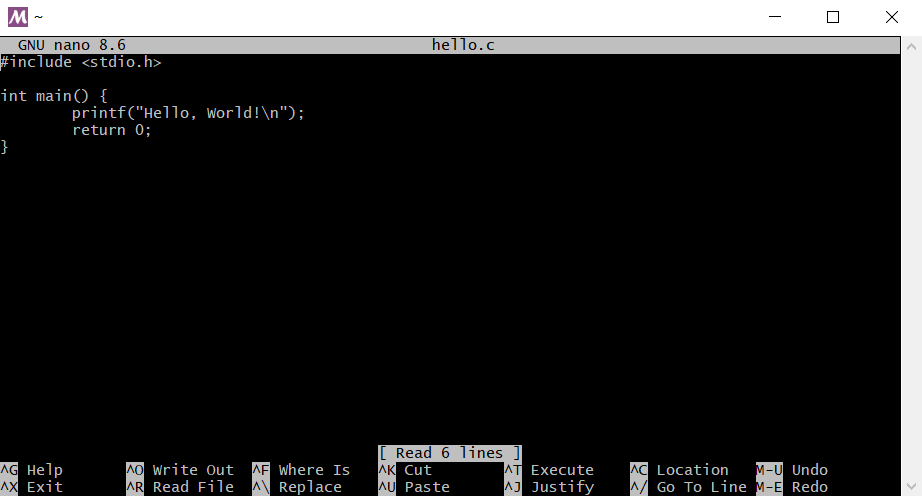
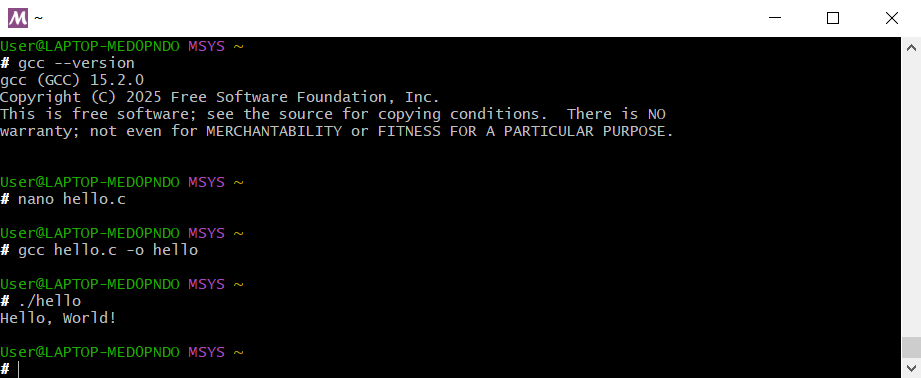

# HW3-1 Answer

## 📘 題目
在 **MSYS2 的操作環境下**，使用 **GNU GCC** 進行範例程式編譯，並以截圖呈現作答。截圖需包含以下內容：

1. 整個 **MSYS2 終端畫面**  
2. 清楚顯示是哪一個版本的 **MSYS2 shell**  
3. 顯示 **gcc 版本（指令與結果）**  
4. 顯示 **程式編譯與執行過程**

---

## 🧩 環境資訊

開啟終端時提示符為：
- User@LAPTOP-MED0PNDO MSYS ~

代表目前使用的是 **MSYS2 的 MSYS shell**

---

## 檢查gcc版本
- gcc (GCC) 15.2.0  
```bash
gcc --version
```
---
## 執行hello.c
- 撰寫程式：
```bash
nano hello.c
```
### 程式碼
**hello.c**
```c
#include <stdio.h>
int main() {
    printf("Hello, World!\n");
    return 0;
}
```

---
- 編譯流程：
```bash
gcc hello.c -o hello
```

- 執行程式：
```bash
./hello
```

- 輸出結果：
```bash
Hello, World!

```


圖1. 程式編寫內容


圖2. 完整MSYS2畫面
