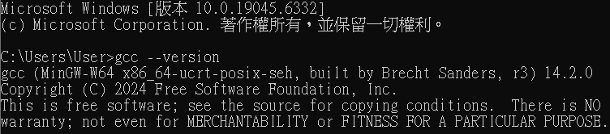
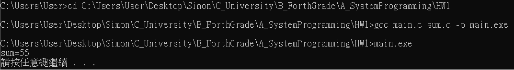

# HW1 Answer

## 1. OS 跟 IDE
- OS：Windows 10  
- IDE：Code::Blocks  

---

## 2. IDE 編譯器
- 編譯器：MinGW GCC  
- 查詢方式：  
```bash
gcc --version
```
---

## 3. Command Line 編譯執行

### 程式碼
**main.c**
```c
#include <stdio.h>
#include <stdlib.h>

int sum(int n);

int main(void){
    int sum1 = sum(10);
    printf("sum=%d\n", sum1);
    system("pause");
    return 1;
}
```
**sum.c**
```c
int sum(int n){
    int s = 0;
    int i;
    for (i = 1; i <= n; i++){
        s = s + i;
    }
    return s;
}
```

---
- 編譯流程：
```bash
cd C:\Users\User\Desktop\Simon\C_University\B_ForthGrade\A_SystemProgramming\HW1
gcc main.c sum.c -o main.exe
```

- 執行程式：
```bash
main.exe
```

- 輸出結果：
```bash
sum=55
請按任意鍵繼續 . . .
```

